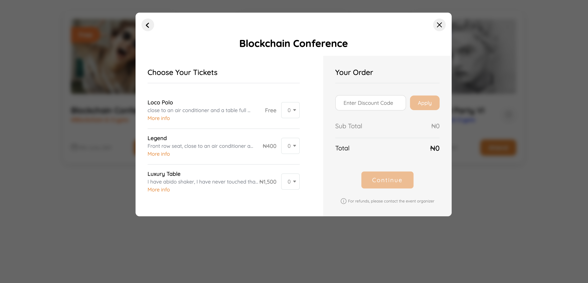

<!--
Get your module up and running quickly.

Find and replace all on all files (CMD+SHIFT+F):
- Name: Yeerlo
- Package name: @yeerlo/nuxt
- Description: Yeerlo's official Nuxt module
-->

# Yeerlo

[![npm version][npm-version-src]][npm-version-href]
[![npm downloads][npm-downloads-src]][npm-downloads-href]
[![License][license-src]][license-href]
[![Nuxt][nuxt-src]][nuxt-href]

Integrate the Yeerlo client library in your nuxt project to start displaying events on your web apps.

## Previews

<p align="center">
  
  
  
</p>

## Features

<!-- Highlight some of the features your module provide here -->
- ⛰ &nbsp;Embed your events
- 🚠 &nbsp;Choose your prefered display formats
- 🌲 &nbsp;Lets users attend and book tickets directly in your web apps without any form of redirection
- 👩‍🎨 &nbsp;Responsive & mobile friendly UI

## Quick Setup

1. Add `@yeerlo/nuxt` dependency to your project

```bash
# Using pnpm
pnpm add -D @yeerlo/nuxt

# Using yarn
yarn add --dev @yeerlo/nuxt

# Using npm
npm install --save-dev @yeerlo/nuxt
```

2. Add `@yeerlo/nuxt` to the `modules` section of `nuxt.config.ts` and setup the runtimeConfig as shown below:

```js
export default defineNuxtConfig({
  ssr: false, // REQUIRED
  modules: [
    '@yeerlo/nuxt'
  ],
  runtimeConfig:{
    public:{
      yeerlo: {
        creatorId: '2bbegYWBgx...', // your yeerlo id
        layoutMode: "events", // one of "events" | "cinemas" and "meetings" are coming soon
        displayFormat: "default", // one of "default", "simple" | "masonry" and "boxed" are coming soon
        limit: 0 // (Optional) total number of events you want to display.
      },
    }
  },
})
```

That's it! You can now use Yeerlo in your Nuxt app ✨

## Development

```bash
# Install dependencies
npm install

# Generate type stubs
npm run dev:prepare

# Develop with the playground
npm run dev

# Build the playground
npm run dev:build

# Run ESLint
npm run lint

# Run Vitest
npm run test
npm run test:watch

# Release new version
npm run release
```

<!-- Badges -->
[npm-version-src]: https://img.shields.io/npm/v/nuxt-yeerlo/latest.svg?style=flat&colorA=18181B&colorB=28CF8D
[npm-version-href]: https://npmjs.com/package/nuxt-yeerlo

[npm-downloads-src]: https://img.shields.io/npm/dm/nuxt-yeerlo.svg?style=flat&colorA=18181B&colorB=28CF8D
[npm-downloads-href]: https://npmjs.com/package/nuxt-yeerlo

[license-src]: https://img.shields.io/npm/l/nuxt-yeerlo.svg?style=flat&colorA=18181B&colorB=28CF8D
[license-href]: https://npmjs.com/package/nuxt-yeerlo

[nuxt-src]: https://img.shields.io/badge/Nuxt-18181B?logo=nuxt.js
[nuxt-href]: https://nuxt.com
